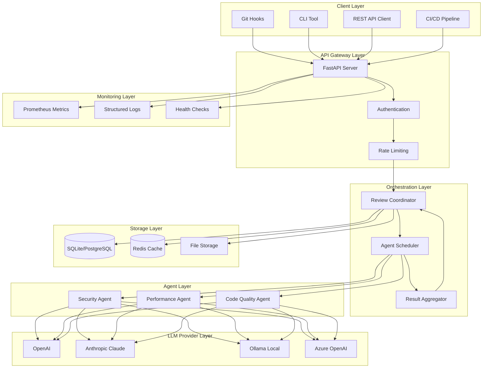

# CodeVault AI - System Architecture & Overview

**Version:** 0.1.0  
**Last Updated:** September 21, 2026  
**Document Status:** Draft

---

## Table of Contents

- [Executive Summary](#executive-summary)
- [What is CodeVault AI?](#what-is-codevault-ai)
- [Key Features](#key-features)
- [System Architecture](#system-architecture)
- [Core Components](#core-components)
- [Data Flow](#data-flow)
- [Technology Stack](#technology-stack)
- [Deployment Architecture](#deployment-architecture)
- [Design Decisions & Trade-offs](#design-decisions--trade-offs)
- [Quick Reference](#quick-reference)
- [Next Steps](#next-steps)

---

## Executive Summary

**CodeVault AI** is an intelligent, multi-agent code review system designed specifically for solo developers and small teams who want enterprise-grade code analysis without the complexity of enterprise tools. 

Unlike traditional static analysis tools that apply rigid rules, CodeVault AI uses multiple specialized AI agents that understand context, provide intelligent suggestions, and explain their reasoning—just like having expert reviewers on your team.

**Key Benefits:**
- **Automated Expert Review**: Get security, performance, and quality insights automatically
- **Zero Configuration Start**: Docker Compose setup in under 5 minutes
- **Seamless Integration**: Works directly in your Git workflow via hooks
- **Privacy-Focused**: Support for local LLM models—your code never leaves your infrastructure
- **Cost-Effective**: Optimized for small teams with intelligent caching and batch processing

---

## What is CodeVault AI?

CodeVault AI is a **multi-agent code review orchestration platform** that analyzes your code from multiple expert perspectives simultaneously:

1. **Security Agent** - Identifies vulnerabilities, security anti-patterns, and compliance issues
2. **Performance Agent** - Detects performance bottlenecks and suggests optimizations
3. **Code Quality Agent** - Reviews maintainability, readability, and best practices

Each agent operates independently but collaboratively, providing comprehensive feedback that goes beyond what any single tool or rule set can offer.

### The Problem We Solve

Solo developers and small teams face a challenge:
- **Manual code review** is time-consuming and inconsistent
- **Traditional static analysis** tools produce too many false positives and lack context
- **Enterprise solutions** are too complex and expensive
- **AI coding assistants** help write code but don't review it comprehensively

CodeVault AI bridges this gap by providing intelligent, contextual code review that's:
- Easy to set up and use
- Affordable for small teams
- Privacy-respecting
- Integrated into existing workflows

---

## Key Features

### 🤖 Multi-Agent Intelligence
- Three specialized AI agents working in parallel
- Context-aware analysis that understands your codebase
- Natural language explanations for every finding

### 🚀 Developer-Friendly Integration
- Git pre-commit and pre-push hooks
- CLI for on-demand reviews
- RESTful API for custom integrations
- IDE plugins (coming soon)

### 🔒 Privacy & Flexibility
- Support for local LLM models (Ollama, LM Studio)
- OpenAI, Anthropic, Azure OpenAI integration
- Configurable data retention policies
- Air-gapped deployment support

### ⚡ Performance & Efficiency
- Intelligent caching to minimize redundant analysis
- Incremental reviews (analyze only changed code)
- Parallel agent execution
- Batch processing for multiple files

### 📊 Actionable Insights
- Severity-based prioritization
- Code snippets with specific recommendations
- Trend analysis across commits
- Export to JSON, Markdown, HTML, SARIF formats

### 🔧 Extensible Architecture
- Custom agent development SDK
- Plugin system for formatters and integrations
- Webhook support for external tools
- Open configuration format

---

## System Architecture

### High-Level Architecture



### Component Interaction Flow

```
┌─────────────┐
│   Client    │
│  (Git Hook) │
└──────┬──────┘
       │ 1. Submit Review Request
       ▼
┌─────────────────────────────────┐
│      API Gateway (FastAPI)      │
│  - Authenticate                 │
│  - Validate Request             │
│  - Rate Limit Check             │
└──────┬──────────────────────────┘
       │ 2. Forward to Coordinator
       ▼
┌─────────────────────────────────┐
│     Review Coordinator          │
│  - Check cache for results      │
│  - Parse code & extract context │
│  - Schedule agent tasks         │
└──────┬──────────────────────────┘
       │ 3. Dispatch to Agents (Parallel)
       ├──────────┬──────────┬────────────┐
       ▼          ▼          ▼            ▼
┌──────────┐ ┌──────────┐ ┌──────────┐
│ Security │ │Performance│ │  Quality │
│  Agent   │ │  Agent    │ │  Agent   │
└────┬─────┘ └────┬──────┘ └────┬─────┘
     │            │             │
     │ 4. Analyze with LLM     │
     ├────────────┼─────────────┤
     ▼            ▼             ▼
┌─────────────────────────────────┐
│      LLM Provider               │
│  (OpenAI / Ollama / Claude)     │
└──────┬──────────────────────────┘
       │ 5. Return Analysis
       ▼
┌─────────────────────────────────┐
│     Result Aggregator           │
│  - Combine agent results        │
│  - Deduplicate findings         │
│  - Calculate aggregate score    │
│  - Format output                │
└──────┬──────────────────────────┘
       │ 6. Store & Return
       ├─────────────────┬──────────────┐
       ▼                 ▼              ▼
┌────────────┐    ┌───────────┐  ┌──────────┐
│  Database  │    │   Cache   │  │  Client  │
│  (persist) │    │  (speed)  │  │ (display)│
└────────────┘    └───────────┘  └──────────┘
```

---

## Core Components

### 1. API Gateway (FastAPI Server)

**Purpose**: Entry point for all client requests, handles authentication, validation, and routing.

**Responsibilities:**
- Request authentication and authorization
- Input validation and sanitization
- Rate limiting and quota enforcement
- Request routing to appropriate handlers
- Response formatting and error handling
- Metrics collection

**Technology**: FastAPI (Python) - chosen for:
- Async/await support for high concurrency
- Automatic OpenAPI documentation
- Type safety with Pydantic
- High performance (comparable to Node.js)

**Key Endpoints:**
- `/api/v1/review` - Submit code for review
- `/api/v1/review/{id}` - Get review status/results
- `/api/v1/agents` - List and configure agents
- `/api/v1/health` - Health check endpoint

### 2. Review Coordinator

**Purpose**: Orchestrates the entire review process from request to response.

**Responsibilities:**
- Parse incoming code and extract metadata
- Check cache for existing review results
- Determine which agents to invoke based on configuration
- Schedule agent execution (parallel or sequential)
- Manage timeouts and retries
- Aggregate results from multiple agents
- Store final review in database and cache

**Key Algorithms:**
- **Cache Key Generation**: Hash of (code content + agent versions + configuration)
- **Agent Selection**: Rule-based selection based on file types and user config
- **Parallel Execution**: asyncio task groups for concurrent agent runs
- **Consensus Building**: Weighted scoring when agents have conflicting opinions

### 3. Agent Scheduler

**Purpose**: Manages agent lifecycle and execution.

**Responsibilities:**
- Initialize agent instances with proper configuration
- Distribute work to agents based on availability
- Monitor agent execution time and resource usage
- Handle agent failures and retries
- Collect agent metrics (execution time, token usage, error rates)

**Execution Modes:**
- **Parallel**: All agents run simultaneously (default, fastest)
- **Sequential**: Agents run one after another (lower resource usage)
- **Priority**: High-priority agents run first, others conditionally

### 4. Individual Agents

Each agent is an independent module that analyzes code from a specific perspective.

#### Security Agent

**Focus**: Identifies security vulnerabilities and compliance issues

**Key Capabilities:**
- SQL injection detection
- XSS vulnerability identification
- Hardcoded secrets scanning
- Insecure cryptography detection
- Authentication/authorization flaws
- Dependency vulnerability checking

**LLM Prompting Strategy:**
- System prompt defines security expertise persona
- Code provided with surrounding context
- Structured output format (JSON schema enforcement)
- Few-shot examples of vulnerabilities

#### Performance Agent

**Focus**: Detects performance bottlenecks and inefficiencies

**Key Capabilities:**
- Algorithmic complexity analysis (O(n²) loops, etc.)
- Memory leak detection
- Inefficient database queries (N+1 problems)
- Unnecessary computations in loops
- Resource-intensive operations
- Caching opportunities

**LLM Prompting Strategy:**
- System prompt emphasizes performance optimization
- Request complexity analysis and concrete metrics
- Ask for specific optimization suggestions with code examples

#### Code Quality Agent

**Focus**: Reviews maintainability, readability, and best practices

**Key Capabilities:**
- Naming convention review
- Code structure and organization
- Design pattern appropriateness
- Code duplication detection
- Documentation completeness
- Test coverage gaps
- SOLID principle violations

**LLM Prompting Strategy:**
- System prompt defines senior developer perspective
- Emphasize maintainability and team collaboration
- Request practical refactoring suggestions

### 5. LLM Provider Abstraction

**Purpose**: Unified interface for multiple LLM backends

**Supported Providers:**
- **OpenAI**: GPT-4, GPT-4-turbo, GPT-3.5-turbo
- **Anthropic**: Claude 3 Opus, Sonnet, Haiku
- **Azure OpenAI**: Enterprise OpenAI deployment
- **Ollama**: Local models (CodeLlama, Mistral, etc.)
- **Custom**: Extensible for other providers

**Abstraction Layer Benefits:**
- Switch providers without changing agent code
- Fallback to alternative providers on failure
- Cost optimization (route to cheaper models when appropriate)
- Privacy control (use local models for sensitive code)

**Implementation Pattern:**
```python
class LLMProvider(ABC):
    @abstractmethod
    async def complete(self, prompt: str, config: dict) -> str:
        pass
    
    @abstractmethod
    async def health_check(self) -> bool:
        pass
```

### 6. Storage Layer

#### Database (SQLite/PostgreSQL)

**Purpose**: Persistent storage for review history, configurations, and metadata

**Schema Overview:**
- `reviews` - Review requests and overall results
- `agent_findings` - Individual findings from each agent
- `code_snapshots` - Code content and metadata (optional retention)
- `configurations` - User and project configurations
- `audit_logs` - Audit trail for compliance

**Why SQLite for POC?**
- Zero configuration
- Single file database
- Perfect for solo developers
- Easy backup and portability

**When to use PostgreSQL?**
- Multiple concurrent users
- Need for advanced querying
- Replication and high availability
- Team collaboration features

#### Cache (Redis)

**Purpose**: High-speed cache for review results and LLM responses

**Cached Data:**
- Recent review results (keyed by code hash)
- LLM responses (for identical prompts)
- Agent execution results
- Frequently accessed configurations

**Cache Strategy:**
- TTL: 7 days for review results
- LRU eviction when memory limit reached
- Cache invalidation on configuration changes

**Performance Impact:**
- Cache hit: <50ms response time
- Cache miss: 5-30s (depends on LLM)
- Cache hit rate target: >70%

### 7. Monitoring & Observability

#### Prometheus Metrics

**Key Metrics Collected:**
- `codevault_review_total` - Total reviews processed
- `codevault_review_duration_seconds` - Review latency
- `codevault_agent_execution_seconds` - Per-agent execution time
- `codevault_llm_tokens_total` - Token usage by provider
- `codevault_cache_hit_rate` - Cache effectiveness
- `codevault_errors_total` - Error rate by type

#### Structured Logging

**Log Levels:**
- DEBUG: Detailed execution flow
- INFO: Key events (review started, completed)
- WARNING: Recoverable issues (cache miss, retry)
- ERROR: Failures requiring attention

**Log Format**: JSON for machine parsing
```json
{
  "timestamp": "2026-09-21T10:30:00Z",
  "level": "INFO",
  "component": "security_agent",
  "review_id": "rev_abc123",
  "message": "Security analysis completed",
  "duration_ms": 3450,
  "findings_count": 2
}
```

---

## Data Flow

### Review Request Lifecycle

**Phase 1: Submission** (0-100ms)
```
Developer commits code
        ↓
Git pre-commit hook triggered
        ↓
Hook invokes CodeVault CLI
        ↓
CLI sends HTTP POST to /api/v1/review
        ↓
API Gateway authenticates & validates
        ↓
Request queued in Review Coordinator
```

**Phase 2: Analysis** (5-30 seconds)
```
Coordinator generates cache key
        ↓
Check Redis cache ─── HIT → Return cached result (fast path)
        ↓ MISS
Extract code context (file type, imports, etc.)
        ↓
Schedule agents (Security, Performance, Quality)
        ↓
Agents execute in parallel:
  │
  ├─→ Security Agent → OpenAI GPT-4 → Security findings
  ├─→ Performance Agent → OpenAI GPT-4 → Performance findings
  └─→ Quality Agent → OpenAI GPT-4 → Quality findings
        ↓
All agents complete
```

**Phase 3: Aggregation** (100-500ms)
```
Result Aggregator receives all findings
        ↓
Deduplicate similar findings
        ↓
Calculate aggregate scores:
  - Overall score (0-100)
  - Security score (0-100)
  - Performance score (0-100)
  - Quality score (0-100)
        ↓
Prioritize findings by severity
        ↓
Format output (JSON/Markdown/HTML)
```

**Phase 4: Storage & Response** (50-200ms)
```
Store review in database
        ↓
Cache results in Redis
        ↓
Update metrics (Prometheus)
        ↓
Return formatted response to client
        ↓
Git hook displays results
        ↓
Developer sees feedback (optionally blocks commit)
```

### Caching Strategy Details

**Cache Key Calculation:**
```python
def generate_cache_key(code: str, config: Config) -> str:
    data = {
        "code_hash": hashlib.sha256(code.encode()).hexdigest(),
        "agent_versions": get_agent_versions(),
        "config_hash": hash_config(config),
        "llm_model": config.llm_model
    }
    return f"review:{hashlib.sha256(json.dumps(data).encode()).hexdigest()}"
```

**Cache Invalidation Triggers:**
- Agent version upgrade
- Configuration change
- Manual cache clear command
- TTL expiration (7 days default)

---

## Technology Stack

### Backend Core

| Component | Technology | Rationale |
|-----------|-----------|-----------|
| **API Framework** | FastAPI 0.104+ | Async support, auto-docs, high performance, type safety |
| **Language** | Python 3.11+ | Rich ecosystem, excellent AI/ML libraries, readable |
| **ASGI Server** | Uvicorn | Production-grade async server, lightweight |
| **Agent Framework** | LangChain 0.1+ | LLM abstraction, prompt management, agent patterns |

### Storage & Caching

| Component | Technology | Rationale |
|-----------|-----------|-----------|
| **Database (POC)** | SQLite 3.40+ | Zero config, portable, perfect for solo devs |
| **Database (Production)** | PostgreSQL 15+ | ACID compliance, JSON support, mature ecosystem |
| **Cache** | Redis 7+ | Extremely fast, persistent, pub/sub for future features |
| **Object Storage** | Local filesystem / S3 | Code snapshots, review archives |

### LLM Integration

| Provider | Models | Use Case |
|----------|--------|----------|
| **OpenAI** | GPT-4, GPT-4-turbo, GPT-3.5 | Best quality, fastest, highest cost |
| **Anthropic** | Claude 3 (Opus, Sonnet) | Great quality, long context, moderate cost |
| **Ollama** | CodeLlama, Mistral, Llama2 | Privacy-first, zero cost, local execution |
| **Azure OpenAI** | Same as OpenAI | Enterprise compliance, existing Azure customers |

### Deployment & Operations

| Component | Technology | Rationale |
|-----------|-----------|-----------|
| **Containerization** | Docker 24+ | Consistent environments, easy distribution |
| **Orchestration (Local)** | Docker Compose | Simple multi-container management |
| **Orchestration (Cloud)** | Kubernetes 1.28+ | Scalable, cloud-agnostic, production-ready |
| **Monitoring** | Prometheus + Grafana | Industry standard, rich ecosystem |
| **Logging** | Python logging + Loki | Structured logs, Grafana integration |

### Development & Testing

| Component | Technology | Rationale |
|-----------|-----------|-----------|
| **Testing** | pytest + pytest-asyncio | De-facto standard for Python testing |
| **Mocking** | pytest-mock, responses | LLM mocking, HTTP mocking |
| **Linting** | ruff, mypy | Fast linting, type checking |
| **Formatting** | black, isort | Consistent code style |
| **CI/CD** | GitHub Actions | Free for open source, excellent integration |

---

## Deployment Architecture

### Local Development (Docker Compose)

```
┌────────────────────────────────────────┐
│          Developer Laptop              │
│                                        │
│  ┌──────────────────────────────┐    │
│  │     Docker Compose           │    │
│  │                              │    │
│  │  ┌─────────────────────┐    │    │
│  │  │  codevault-api      │    │    │
│  │  │  (FastAPI)          │    │    │
│  │  │  Port: 8000         │    │    │
│  │  └──────────┬──────────┘    │    │
│  │             │                │    │
│  │  ┌──────────┴──────────┐    │    │
│  │  │  codevault-redis    │    │    │
│  │  │  Port: 6379         │    │    │
│  │  └─────────────────────┘    │    │
│  │             │                │    │
│  │  ┌──────────┴──────────┐    │    │
│  │  │  codevault-db       │    │    │
│  │  │  (PostgreSQL)       │    │    │
│  │  │  Port: 5432         │    │    │
│  │  └─────────────────────┘    │    │
│  │             │                │    │
│  │  ┌──────────┴──────────┐    │    │
│  │  │  prometheus         │    │    │
│  │  │  Port: 9090         │    │    │
│  │  └─────────────────────┘    │    │
│  │             │                │    │
│  │  ┌──────────┴──────────┐    │    │
│  │  │  grafana            │    │    │
│  │  │  Port: 3000         │    │    │
│  │  └─────────────────────┘    │    │
│  └──────────────────────────────┘    │
│                                        │
│  ┌──────────────────────────────┐    │
│  │  Git Hooks (pre-commit)      │    │
│  │  → curl localhost:8000       │    │
│  └──────────────────────────────┘    │
└────────────────────────────────────────┘
```

**Characteristics:**
- Single command setup: `docker-compose up`
- All services on localhost
- Persistent volumes for data
- Hot reload for development
- Zero cloud costs

### Cloud Deployment (AWS Example)

```
┌─────────────────────────────────────────────────────┐
│                    AWS Cloud                        │
│                                                     │
│  ┌────────────────────────────────────────────┐   │
│  │          Application Load Balancer         │   │
│  │          (TLS termination)                 │   │
│  └───────────────────┬────────────────────────┘   │
│                      │                             │
│  ┌───────────────────┴────────────────────────┐   │
│  │         ECS Fargate Cluster                │   │
│  │                                            │   │
│  │  ┌──────────────────────────────────┐    │   │
│  │  │  CodeVault API (3 tasks)         │    │   │
│  │  │  - Auto-scaling 1-10 tasks       │    │   │
│  │  │  - CPU/Memory limits             │    │   │
│  │  └──────────────┬───────────────────┘    │   │
│  └─────────────────┼────────────────────────┘   │
│                    │                             │
│  ┌─────────────────┴────────────────────────┐   │
│  │         ElastiCache Redis                │   │
│  │         (Multi-AZ, Replication)          │   │
│  └──────────────────────────────────────────┘   │
│                    │                             │
│  ┌─────────────────┴────────────────────────┐   │
│  │         RDS PostgreSQL                   │   │
│  │         (Multi-AZ, Auto-backup)          │   │
│  └──────────────────────────────────────────┘   │
│                    │                             │
│  ┌─────────────────┴────────────────────────┐   │
│  │         CloudWatch                       │   │
│  │         (Logs + Metrics)                 │   │
│  └──────────────────────────────────────────┘   │
│                                                     │
│  ┌──────────────────────────────────────────┐   │
│  │         Secrets Manager                  │   │
│  │         (API Keys, Credentials)          │   │
│  └──────────────────────────────────────────┘   │
└─────────────────────────────────────────────────────┘
```

**Characteristics:**
- Managed services (less operational overhead)
- Auto-scaling based on load
- High availability (Multi-AZ)
- Secure secrets management
- Monitoring and alerting built-in

### Kubernetes Deployment (Any Cloud)

```
┌─────────────────────────────────────────────────────┐
│            Kubernetes Cluster                       │
│                                                     │
│  ┌────────────────────────────────────────────┐   │
│  │          Ingress Controller                │   │
│  │          (nginx/traefik)                   │   │
│  └───────────────────┬────────────────────────┘   │
│                      │                             │
│  ┌───────────────────┴────────────────────────┐   │
│  │     Namespace: codevault                   │   │
│  │                                            │   │
│  │  ┌──────────────────────────────────┐    │   │
│  │  │  Deployment: api (3 replicas)    │    │   │
│  │  │  - HPA: 1-10 replicas            │    │   │
│  │  │  - Resource limits               │    │   │
│  │  │  - Liveness/Readiness probes     │    │   │
│  │  └──────────────┬───────────────────┘    │   │
│  │                 │                         │   │
│  │  ┌──────────────┴───────────────────┐    │   │
│  │  │  Service: codevault-api          │    │   │
│  │  │  Type: ClusterIP                 │    │   │
│  │  └──────────────────────────────────┘    │   │
│  │                 │                         │   │
│  │  ┌──────────────┴───────────────────┐    │   │
│  │  │  StatefulSet: redis              │    │   │
│  │  │  - Persistent volumes            │    │   │
│  │  └──────────────────────────────────┘    │   │
│  │                 │                         │   │
│  │  ┌──────────────┴───────────────────┐    │   │
│  │  │  StatefulSet: postgresql         │    │   │
│  │  │  - Persistent volumes            │    │   │
│  │  │  - Automated backups             │    │   │
│  │  └──────────────────────────────────┘    │   │
│  │                 │                         │   │
│  │  ┌──────────────┴───────────────────┐    │   │
│  │  │  ConfigMap: app-config           │    │   │
│  │  └──────────────────────────────────┘    │   │
│  │                 │                         │   │
│  │  ┌──────────────┴───────────────────┐    │   │
│  │  │  Secret: api-keys                │    │   │
│  │  └──────────────────────────────────┘    │   │
│  └────────────────────────────────────────┘   │
│                                                     │
│  ┌────────────────────────────────────────────┐   │
│  │     Namespace: monitoring                  │   │
│  │                                            │   │
│  │  ┌──────────────────────────────────┐    │   │
│  │  │  Prometheus                      │    │   │
│  │  └──────────────────────────────────┘    │   │
│  │  ┌──────────────────────────────────┐    │   │
│  │  │  Grafana                         │    │   │
│  │  └──────────────────────────────────┘    │   │
│  └────────────────────────────────────────────┘   │
└─────────────────────────────────────────────────────┘
```

**Characteristics:**
- Cloud-agnostic (works on any K8s)
- Advanced orchestration features
- Rolling updates, rollbacks
- Resource management and quotas
- Service mesh ready (future)

---

## Design Decisions & Trade-offs

### 1. Multi-Agent Architecture vs. Single LLM Call

**Decision**: Use multiple specialized agents instead of one general-purpose call

**Rationale:**
- **Better Quality**: Each agent has focused expertise and optimized prompts
- **Parallel Execution**: Faster than sequential analysis
- **Configurability**: Enable/disable specific agents based on needs
- **Cost Optimization**: Use different models per agent (GPT-4 for security, GPT-3.5 for style)

**Trade-off**: More complex orchestration, higher cost if all agents use expensive models

**Mitigation**: Intelligent caching, configurable agent selection, support for cheaper local models

### 2. FastAPI (Python) vs. Node.js/Go

**Decision**: Python with FastAPI

**Rationale:**
- **LLM Ecosystem**: Python has best AI/ML library support
- **Developer Experience**: Type hints, async/await, excellent tooling
- **Performance**: FastAPI is comparable to Node.js for I/O-bound workloads
- **Community**: Large Python community in AI/ML space

**Trade-off**: Slower than Go for CPU-intensive tasks, higher memory usage than Node.js

**Mitigation**: Use async patterns, containerization for resource limits, offload heavy computation

### 3. SQLite vs. PostgreSQL Default

**Decision**: SQLite for POC/MVP, PostgreSQL for production

**Rationale:**
- **Zero Config**: SQLite requires no setup for solo developers
- **Portability**: Single file database, easy backup
- **Sufficient**: Handles solo dev/small team workload
- **Migration Path**: Easy to migrate to PostgreSQL later

**Trade-off**: SQLite has limited concurrency, no replication

**Mitigation**: Clear documentation on when to upgrade, automated migration scripts

### 4. Synchronous vs. Asynchronous Agent Execution

**Decision**: Asynchronous (parallel) by default, configurable

**Rationale:**
- **Speed**: 3 agents in parallel = 3x faster than sequential
- **User Experience**: Faster feedback in Git hooks
- **Resource Efficiency**: Better utilization of I/O wait time

**Trade-off**: Higher resource usage (memory, CPU) during execution

**Mitigation**: Configurable execution mode, resource limits, queue-based processing option

### 5. Caching Strategy

**Decision**: Aggressive caching with Redis, 7-day TTL

**Rationale:**
- **Cost**: LLM calls are expensive (time and money)
- **Speed**: Cache hits are 100x faster than LLM calls
- **Repeatability**: Same code = same results (within version constraints)

**Trade-off**: Stale results if agent improvements aren't reflected

**Mitigation**: Cache invalidation on agent version changes, configurable TTL

### 6. Git Hooks vs. CI/CD Only

**Decision**: Primary integration via Git hooks, CI/CD as alternative

**Rationale:**
- **Fast Feedback**: Developers get immediate feedback before commit
- **Prevent Bad Commits**: Block issues before they enter history
- **Workflow Integration**: Seamless, no separate step needed

**Trade-off**: Adds latency to git operations, requires local setup

**Mitigation**: 
- Async mode (commit proceeds, results sent later)
- Cache for fast repeated reviews
- Advisory mode (don't block, just warn)
- CI/CD option for teams that prefer server-side only

### 7. Multi-Provider LLM Support vs. OpenAI Only

**Decision**: Support multiple LLM providers from day one

**Rationale:**
- **Privacy**: Local models for sensitive code
- **Cost**: Flexibility to use cheaper models
- **Availability**: Fallback if one provider has issues
- **Future-Proofing**: LLM landscape is evolving rapidly

**Trade-off**: More complex abstraction layer, testing burden

**Mitigation**: Well-defined provider interface, comprehensive test mocks

### 8. Language-Agnostic vs. Language-Specific Agents

**Decision**: Language-agnostic agents using LLM context

**Rationale:**
- **Simplicity**: One set of agents works for all languages
- **LLM Capability**: Modern LLMs understand many languages
- **Maintenance**: No need for language-specific rules

**Trade-off**: May miss language-specific patterns that AST analysis would catch

**Mitigation**: 
- Provide language context to LLM
- Future: Optional language-specific pre-processors
- Combine with traditional linters (ESLint, Pylint, etc.)

---

## Quick Reference

### System Components at a Glance

| Component | Purpose | Technology | Port |
|-----------|---------|-----------|------|
| API Gateway | Request handling | FastAPI | 8000 |
| Review Coordinator | Orchestration | Python | - |
| Security Agent | Security analysis | LangChain + LLM | - |
| Performance Agent | Performance analysis | LangChain + LLM | - |
| Code Quality Agent | Quality analysis | LangChain + LLM | - |
| Database | Persistent storage | SQLite/PostgreSQL | 5432 |
| Cache | Result caching | Redis | 6379 |
| Metrics | Monitoring | Prometheus | 9090 |
| Dashboards | Visualization | Grafana | 3000 |

### Key Metrics

| Metric | Target | Purpose |
|--------|--------|---------|
| Review Latency (cached) | <50ms | Fast feedback for cached results |
| Review Latency (uncached) | 5-30s | Acceptable for LLM analysis |
| Cache Hit Rate | >70% | Cost and speed optimization |
| Agent Success Rate | >99% | Reliability |
| API Availability | >99.9% | System reliability |

### File Structure Overview

```
codevault-ai/
├── api/                    # FastAPI application
│   ├── routes/            # API endpoints
│   ├── middleware/        # Auth, rate limiting, etc.
│   └── models/            # Pydantic models
├── agents/                # Agent implementations
│   ├── base.py           # Base agent class
│   ├── security.py       # Security agent
│   ├── performance.py    # Performance agent
│   └── quality.py        # Code quality agent
├── orchestration/         # Coordinator and scheduler
│   ├── coordinator.py
│   └── scheduler.py
├── llm/                   # LLM provider abstractions
│   ├── base.py
│   ├── openai.py
│   ├── anthropic.py
│   └── ollama.py
├── storage/               # Database and cache
│   ├── database.py
│   └── cache.py
├── cli/                   # Command-line interface
├── hooks/                 # Git hook scripts
├── config/                # Configuration management
├── tests/                 # Test suite
└── docs/                  # Documentation (you are here!)
```

---

## Next Steps

Now that you understand the high-level architecture of CodeVault AI, here's where to go next:

### For Developers Getting Started
👉 **[Installation & Setup Guide](04-installation-setup.md)** - Get CodeVault AI running in 5 minutes

### For Understanding the API
👉 **[API Reference](02-api-reference.md)** - Complete REST API documentation with examples

### For Customizing Behavior
👉 **[Agent Specifications](03-agent-specifications.md)** - Learn how each agent works and how to configure them

👉 **[Configuration Reference](05-configuration-reference.md)** - All configuration options explained

### For Operations Teams
👉 **[Monitoring & Operations Guide](06-monitoring-operations.md)** - Running in production, troubleshooting, optimization

👉 **[Security & Compliance Guide](07-security-compliance.md)** - Security best practices and data handling

### For Contributors
👉 **[Developer Guide](08-developer-guide.md)** - Contributing code, creating custom agents, extending functionality

---

## Document Information

**Version**: 0.1.0  
**Last Updated**: September 21, 2026  
**Maintained By**: CodeVault AI Team  
**License**: MIT  

**Related Documents**:
- [API Reference](02-api-reference.md)
- [Installation Guide](04-installation-setup.md)
- [FAQ](FAQ.md)

**Feedback**: Found an error or have suggestions? [Open an issue](https://github.com/codevault-ai/codevault/issues) or contribute to the docs!

---

*CodeVault AI - Intelligent Code Review for Modern Developers*
